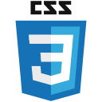
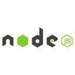

<h1 align="center">Hello 👋, I'm Borja</h1>
<h3 align="center">a Full-Stack Web Developer from Spain 🇪🇸.</h3>

- 🔭 I’m currently working on **EduCard, an educational web app for helping teachers develop their students' active recall and spaced repetition.**

- 📚 I’m currently learning **Next.js**

- 💻 All of my projects are available at [https://borjamarti.netlify.app/](https://borjamarti.netlify.app/)

- 📫 You can reach me at **borjamarti@outlook.com**

- 👨‍🏫 And if you want to learn more about MVC, check out [my lecture](https://github.com/borjaMarti/mvc-lecture)!

<h2>Project Showcase</h2>
 
<table bordercolor="#66b2b2" align="center">
  <tr>
    <td align="center" width="50%">
          <h3 class="projectTitle">Art Dose</h3>
           
          
          

              
              
          

             
          Explore and draw inspiration with random pieces of art from The Metropolitan Museum of New York's collection!
    </td>
    <td align="center" width="50%">
          <h3 class="projectTitle">Would You Rather</h3>
           
          
          

              
              
          

             
          Play an online game of Would you Rather! See other people's votes, leave comments on the questions, and create your own.
    </td>
  </tr>
</table>

<h3 align="center">My Tech Stack:</h3>

          

