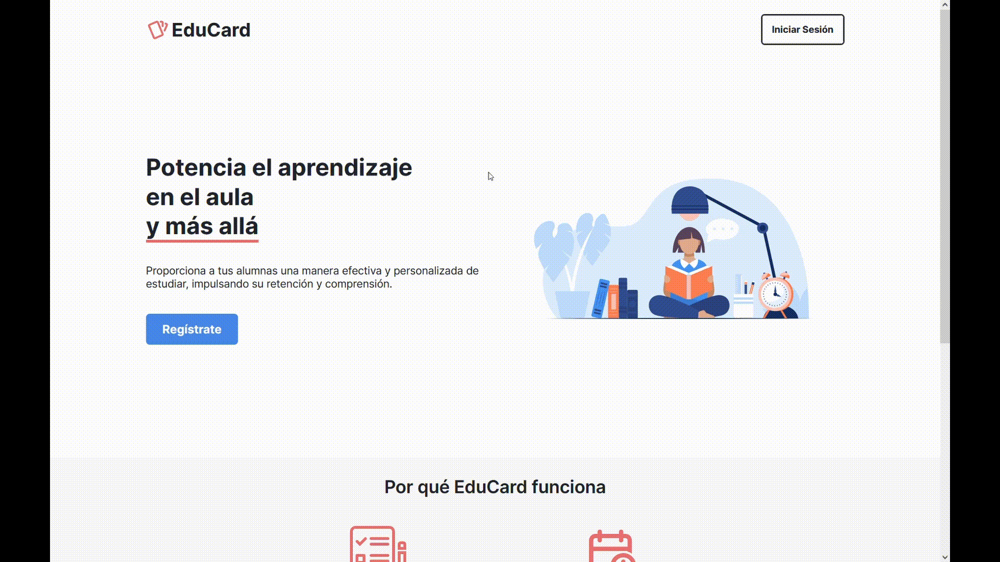

<h1 align="center">Hello 👋🏼, I'm Borja</h1>
<h3 align="center">a Full-Stack Web Developer from Spain 🇪🇸.</h3>
 

- 🔭 I’m currently working on **[EduCard](https://github.com/borjaMarti/educard), a web app for helping teachers develop their students' active recall and spaced repetition habits through the use of flashcards**.

- 📚 I’m also learning **React Native**.

- 💻 More info about me and my projects here: [borjamarti.dev](https://borjamarti.dev)

- 📫 You can reach me at **borjamarti@outlook.com**

- 👨‍🏫 And if you want to learn more about MVC, check out [my lecture](https://www.youtube.com/watch?v=SIHGbcEUIAU)!
  
<h2>Project Showcase</h2>
 
<table style="overflow-x: scroll">
  <tr>
   <td align="center">
      <h3>EduCard</h3>
       
      
      

         
        
        
      

       
      

        EduCard is a web application that helps teachers develop their students' active recall and spaced repetition habits by using flashcards.
      

       
    </td>
    <td align="center">
      <h3>Would You Rather</h3>
       
      
      

         
        
        
      

       
      

        Play an online game of Would you Rather! See other people's votes, leave comments on the questions, create your own - have fun!
      

       
    </td>
  </tr>
</table>
 
<h3 align="center">My Tech Stack:</h3>
 

   
  
  
   
  
  
  
  
  

