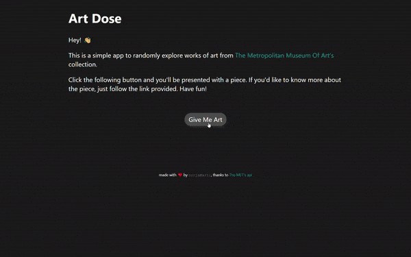

<h1 align="center">Hello 👋, I'm Borja</h1>
<h3 align="center">a Full-Stack Web Developer from Spain 🇪🇸.</h3>

- 🔭 I’m currently working on **an educational tool to help teachers develop their students' spaced repetition.**

- 📚 I’m currently learning **Node.js**

- 💻 All of my projects are available at [https://borjamarti.netlify.app/](https://borjamarti.netlify.app/)

- 📫 You can reach me at **borjamarti@outlook.com**

<h3 align="left">Connect with me:</h3>

<h3 align="left">Tech Stack:</h3>

      

<h2>Project Showcase</h2>
<table bordercolor="#66b2b2">
  
  <tr>
    <td width="50%" valign="top">
      <h3 align="center">Travelara.org</h3>
         
        
         
        

          
    
  <a href="https://borjamarti.github.io/artDose/" target="_blank">
    <svg fill="#ffffff" xmlns="http://www.w3.org/2000/svg" width="64px" height="64px" viewBox="0 0 52 52" enable-background="new 0 0 52 52" xml:space="preserve"><g id="SVGRepo_bgCarrier" stroke-width="0"></g><g id="SVGRepo_tracerCarrier" stroke-linecap="round" stroke-linejoin="round"></g><g id="SVGRepo_iconCarrier"> <g> <path d="M48.7,2H29.6C28.8,2,28,2.5,28,3.3v3C28,7.1,28.7,8,29.6,8h7.9c0.9,0,1.4,1,0.7,1.6l-17,17 c-0.6,0.6-0.6,1.5,0,2.1l2.1,2.1c0.6,0.6,1.5,0.6,2.1,0l17-17c0.6-0.6,1.6-0.2,1.6,0.7v7.9c0,0.8,0.8,1.7,1.6,1.7h2.9 c0.8,0,1.5-0.9,1.5-1.7v-19C50,2.5,49.5,2,48.7,2z"></path> <path d="M36.3,25.5L32.9,29c-0.6,0.6-0.9,1.3-0.9,2.1v11.4c0,0.8-0.7,1.5-1.5,1.5h-21C8.7,44,8,43.3,8,42.5v-21 C8,20.7,8.7,20,9.5,20H21c0.8,0,1.6-0.3,2.1-0.9l3.4-3.4c0.6-0.6,0.2-1.7-0.7-1.7H6c-2.2,0-4,1.8-4,4v28c0,2.2,1.8,4,4,4h28 c2.2,0,4-1.8,4-4V26.2C38,25.3,36.9,24.9,36.3,25.5z"></path> </g> </g></svg>
  </a>
      

      <ul font-variant="smallcaps">
            <li>JavaScript</li>
      </ul>
        
Explore and draw inspiration with random pieces of art from The Metropolitan Museum of New York's collection!

    </td>
